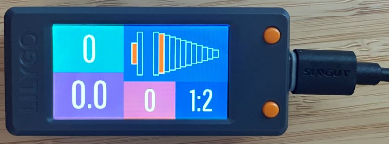

# External Display for WAHOO KICKR BIKE SHIFT
Code is written for LILYGO T-Display-S3 ESP32-S3 or LILYGO TTGO T-Display ESP32 and displays the following Bluetooth Low Energy (BLE) data:

- Gearing ratio (as set in the wahoo app) and what gears you are currently in. Information (text and graphic) will update when shifting.
- Cyclist weight (as set in the wahoo app)
- Cycling power measurement (Watt or Watts Per Kilogram). Displayed information can be changed via a button (BOOT) on the device.

## Setup
You need to install the Arduino IDE to compile and upload the code to the microcontroller. A very good HOWTO can be found here:
https://github.com/teastainGit/LilyGO-T-display-S3-setup-and-examples/blob/main/T-DisplayS3_Setup.txt

## TFT_eSPI - ..\libraries\TFT_eSPI\User_Setup_Select
The line ""#include <User_Setups/Setup206_LilyGo_T_Display_S3.h>" should be 
- un-commented for LILYGO T-Display-S3 ESP32-S3
- commented for LILYGO TTGO T-Display ESP32

## A few things to consider

1. If you have changed the Bluetooth name of your bike (in the wahoo app) you will need to change it also in the code:

> // BLE Server name
> 
> #define bleServerName "KICKR BIKE SHIFT 720C"

2. Display Resolution
170 x 320 ... LILYGO T-Display-S3 ESP32-S3
135 x 240 ... LILYGO TTGO T-Display ESP32
   
> #define RESOLUTION_X 320
> 
> #define RESOLUTION_Y 170

3. The graphic should scale depending on the gearing setting, so it will fit the screen. (There are variables to change the rendering if necessary.)

> int myGearWidth = (IWIDTH - 35) / (myFrontGears + myRearGears);
> 
> #define myGearHeight (RESOLUTION_Y - 60)
> 
> #define myGearSpacing -1
> 
> #define myGearX 15
> 
> #define myGearY 30

4. Debugging: All Status messages during initiation and during connecting process will be displayed on the TFT and in the serial monitor window of the IDE. I tried to comment the code so that it is easier to understand.

5. To identify BLE GATT servies and characteristics use https://www.bluetooth.com/specifications/assigned-numbers/ and if you look at GATT Specification Supplement 5 it describes how to intepret the bytes: https://www.bluetooth.com/specifications/specs/gatt-specification-supplement-5/
   
7. Scan BLE devices: https://www.nordicsemi.com/Products/Development-tools/nrf-connect-for-mobile

Enter the upload mode manually.
- Connect the board via the USB cable
- Press and hold the BOOT button (next to RST) , While still pressing the BOOT button, press RST
- Release the RST
- Release the BOOT button
- Upload sketch
